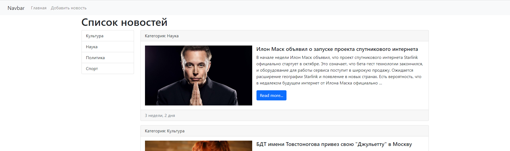
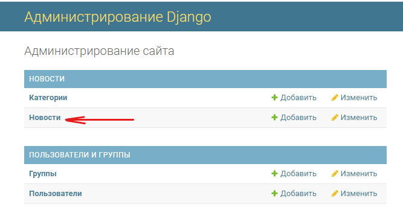

# News blog

---
#### (under development)
This is just a news blog.

In order to use this blog, you need to create a database (blog use mysql) and specify it in a variable "DATABASES" (path: News_Blog/News_blog/settings.py):
> DATABASES = {
    'default': {
        'ENGINE': 'django.db.backends.mysql',
        'NAME': 'db_news',
        'USER': 'root',
        'PASSWORD': 'qwerty',
        'HOST': 'localhost'
    }
}
 
You need to enter the database NAME, USERNAME and PASSWORD (from MySQL workbench). Also, you can remove all media from 'News_Blog/media'.

After  you have connected the database, you have to make migrations: 
>python manage.py migrate
> 
>python manage.py makemigrations

After that, you have to create a superuser:
> python manage.py createsuperuser
 
Enter Username, Email address and password.

Then you can start the test server:
>python manage.py runserver

Use your username and password to enter: http://127.0.0.1:8000/admin/

And now you can add news, and they will be displayed on the main page: http://127.0.0.1:8000

Thank you!

